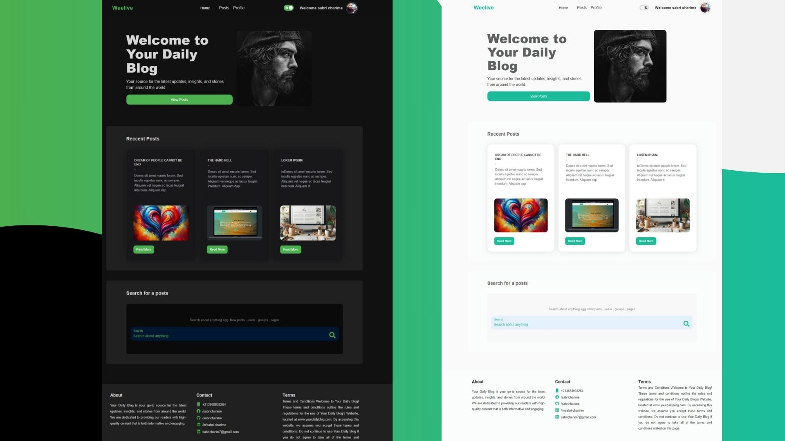
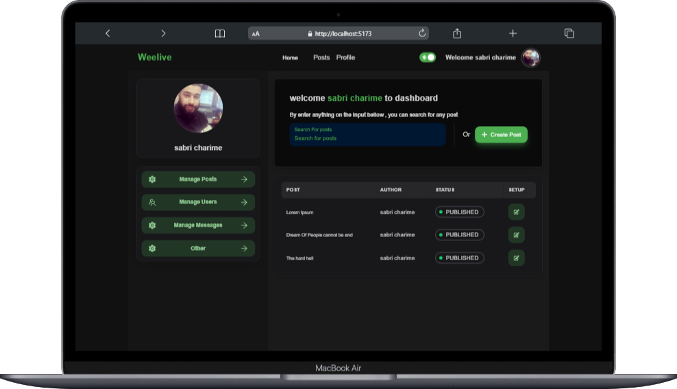

# fullstack_blog
# Author: @Sabri charime
## Introduction

This blog application is designed to provide a seamless and interactive experience for users to read, create, and manage blog posts. It leverages the powerful PERN stack to deliver a robust and scalable solution.





## Features
- **Responsive Design**: Works on all devices including desktop, tablet, and mobile.
- **User Authentication**: Secure login and registration system.
- **CRUD Operations**: Create, Read, Update, and Delete blog posts.
- **Rich Text Editor**: Write blog posts with a rich text editor.
- **Comment System**: Users can comment on blog posts.
- **Likes System**: Users can like blog posts.
- **Admin Panel**: Manage users and posts.

## Getting Started

Follow these instructions to get a copy of the project up and running on your local machine for development and testing purposes.

### Prerequisites

Make sure you have the following installed:

- [Node.js](https://nodejs.org/)
- [PostgreSQL](https://www.postgresql.org/)
- [npm](https://www.npmjs.com/)

### Installation

1. Clone the repository:
    ```bash
    git clone https://github.com/sabricharime/fullstack_blog.git
    cd fullstack_blog
    ```

2. Install dependencies for the backend :
    ```bash
      npm run install
    ```
3. (.env) file configuration:
    - DATABASE_URL="YOUR DATABASE URL"
    - ACCESS_SECRETE = "Your Access secrete"
    - REFRESH_SECRETE = "Your refresh token secrete"
    - ACCESS_EXPIRE= 5m
    - REFRESH_EXPIRE= 1d
    - PORT=3000


### Usage

1. build the Project server and fronend :
    ```bash
      npm run build
    ```
2. start the project as production mode:
    ```bash
    npm start 
   ```


Visit `http://localhost:3000` to view the application.


## License

This project is licensed under the MIT License - see the [LICENSE](LICENSE) file for details.

## Contact

**Sabri Charime**

- GitHub: [sabricharime](https://github.com/sabricharime)
- Email: [sabricharim7@gmail.com](sabricharim7@gmail.com)


